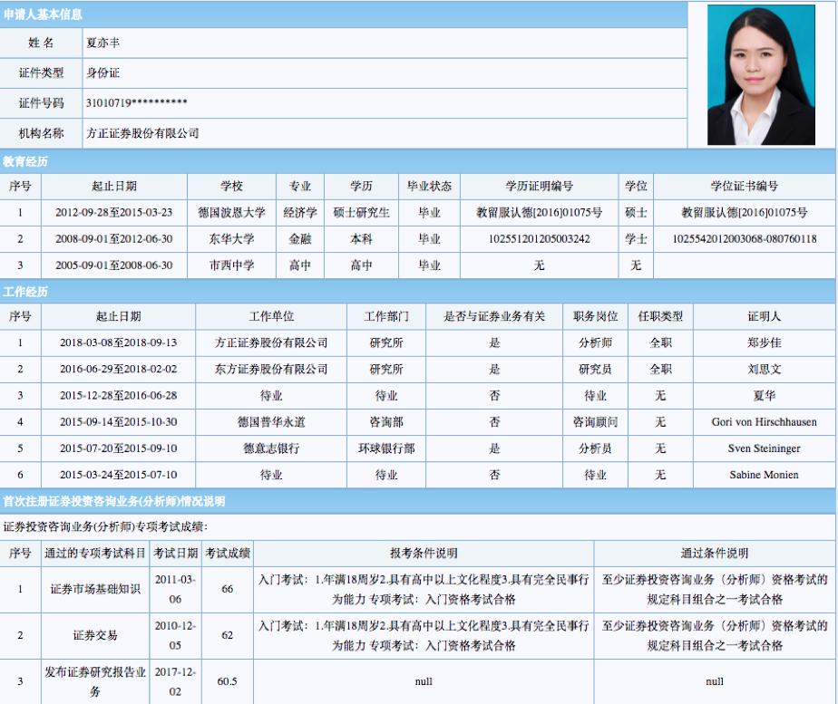

## China Financial Market Datasets - 中国金融市场相关数据集

#### Author: Jiawen Yan
#### Email: yjw9100@hotmail.com
#### Last Update: 2020.5.1

> :thumbsup: **_If you want to support or use the full dataset(s) for academic purpose, please contact me through the abovementioned email._**

---

#### （1）Site-Visit Dataset -分析师实地调研数据集

* Site-visitation record of all buyside and sellside analysts
* 

##### Variables Definition

 - `changepercent`: stock return of corresponding stock on visiting day
 - `close`: close price of corresponding stock on visiting day
 - `companycode`: company 8-digit identification code
 - `companyname`: company's official name
 - `orgcode`: organization code
 - `orgname`: organization name
 - `orgsum`: -
 - `scode`: stock exchange trading code
 - `sname`: stock exchange trading name
 - `noticedate`: notice publishing date
 - `startdate`: site visit starting date
 - `enddate`: site visit ending date
 - `place`: site visit place
 - `description` : site visit detail description
 - `orgtype`: visitor's organization type
 - `orgtypename` : visitor's organization name
 - `personnel` : name of visitor
 - `licostaff` : staff name holding the site visit 
 - `maincontent`: main site visit content 

---

#### （2） Listed Companies' Notice Dataset - 中国上市公司公告数据集

##### Variables Definition:

> NB: Many variables are *None* because the official website  does not provide such content but have such columns. Here, I kept the original format in max extent in case some of them are not None 

* `SecCode`: security trading code at exchange (6-digits)
* `announcementId`: notice announcement ID 
* `announcementContent`: *None* (content is not in this variable)
* `accouncementTitle`: notice announcement title 
* `associateAnnouncement`: announcement id if related to another announcement, else is None
* `id`: *None*
* `pageColumn`: *None* 
* `important`: *None*
* `accouncementType`: *None*
* `orgID`: organization ID 
* `batchNum`: *None*
* `adjunctsize`:  file size of related report
* `secName`: name of trading security, four chinese characters
* `adjunctUrl`: the URL of related announcement file 
* `adjunctType`: the file type related announcement
* `announcementTime`: the unix time of announcement time
* `storageTime`: *None*
* `announcementTypeName`: *None*

#### （3）Analyst Profile - 中国卖方分析师简历数据

* Detailed analyst profile data public available at https://www.sac.net.cn
* Analyst General Information Data
* Analyst Educational Backgroudn Data
* Analyst Working Experience Data 
* Analyst Test Score Data 
* * 

