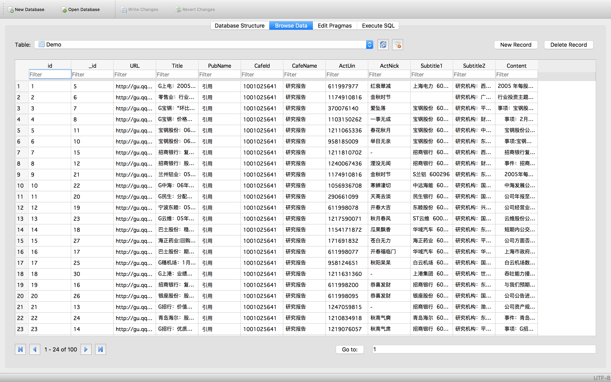
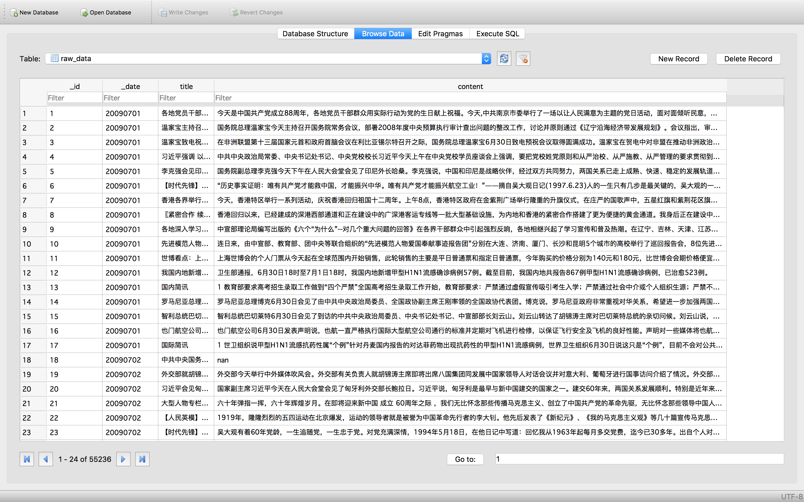
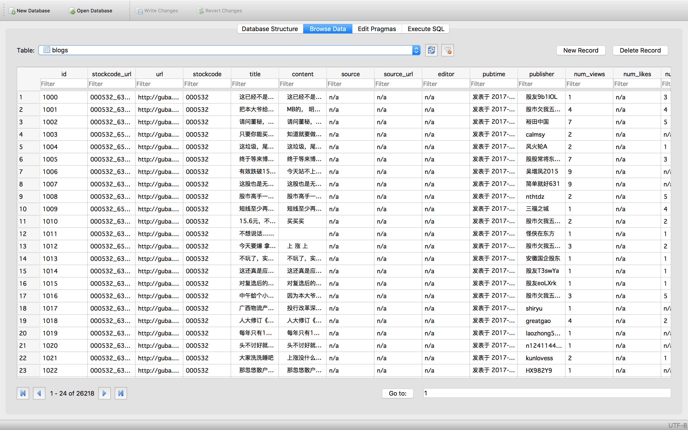
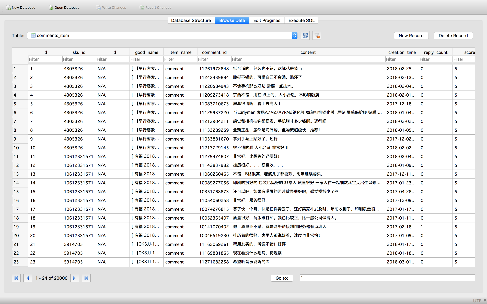
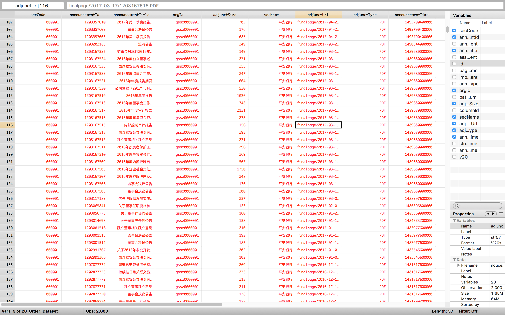
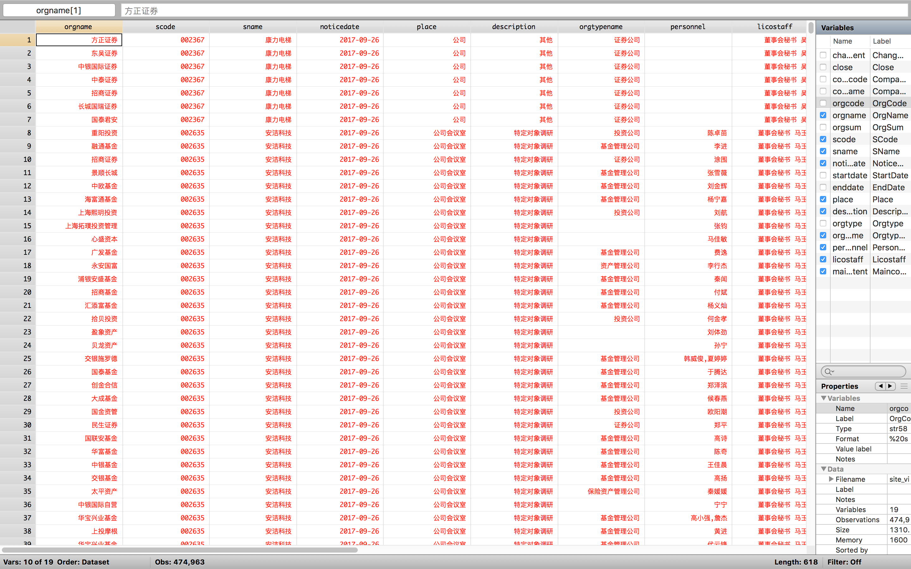

## Sample Datasets

#### Author: Jiawen Yan
#### Email: yjw9100@hotmail.com
#### Last Update: 2019.4.4

**The datasets presented below are for demonstration purpose only, please do not cite or circulate without permission.**

*Some datasets are database files in SQLite format (.db). To browse or export data, you may download and install SQLite browser from https://sqlitebrowser.org. And some datasets are .dta files, which can be open with Stata version 14 or higher, or with Python Pandas package.*

1. Analyst Report Dataset (Demo) 
-------
	* Over 1 million detailed analyst report datasets from Tencent Finance during 2006 to 2018;
	* Structured data including stock code, date, analyst name, affiliated brokerage, and textual report;
	* 

2. CCTV Dataset (Demo)
-------
	* CCTV news transcript from 2009;
	* 

3. Eastmoney Dataset (Demo)
-------
	* Data are collect from Eastmoney.com or Guba up to mid 2018;
	* Four sections including news, notice, analyst report, blog and reply;
	* 

4. JD Comment Dataset (Demo)
-------
	* JD Product Review Dataset
	* 

5. China-Financial-Market (Demo)
-------
	* Listed Company's Notice Dataset
		* Meta file of all listed company's notice
		* 
	* Site-Visit Dataset
		* Site-visitation record of all buyside and sellside analysts
		* 

